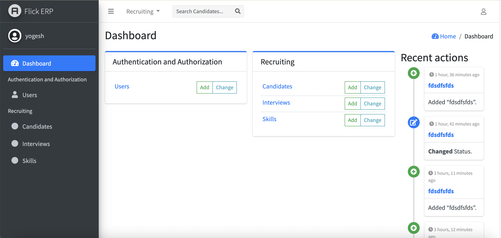
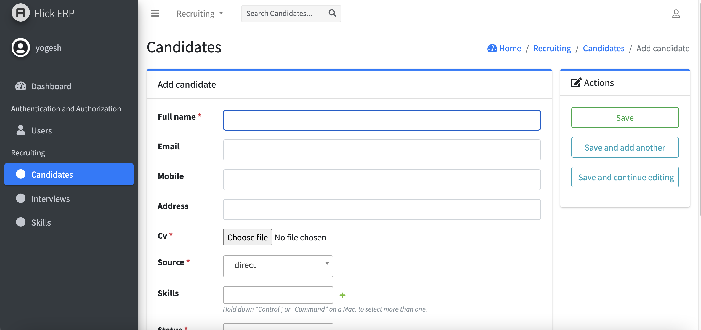
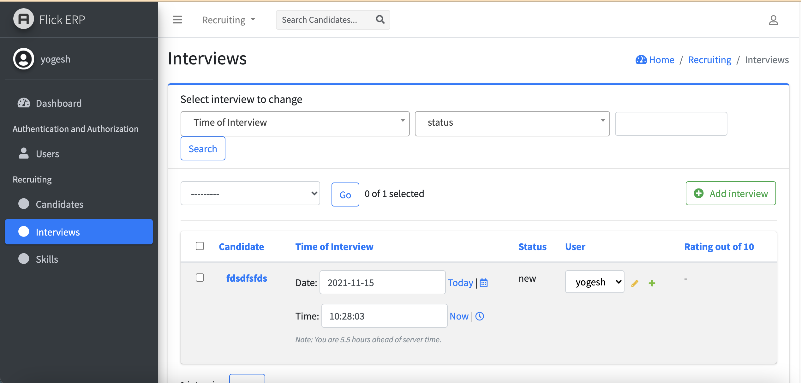

# FlickERP HRMS, Employee Attendence and Salary

Web based Human Resource Management System

## Table of Contents

1. [Overview](#overview)
2. [Screenshots](#screenshots)
3. [Features](#features)
4. [Installation](#installation)
5. [Contribution](#contributing)

## Overview

Flick ERP is a web application to support  human resource requirements.  
The application Python3 and Django3.2 including django jazzmin admin them.  


## Screenshots

### Dashboard



### Upload New CV and fill new interview details



### Schedule Interview



## Features

The following is a list of the main features.

### Candidate Database

Record Candidate details, including a CV, job role, manager, department, address and skils.  
Quick search displaying contact details including email address and telephone.
Candidate details includes status like , in interview , seelcted , rejected and many more.
Color based filter and easy to use. can  use by a team and big company.

### Candidate Listing

Candidate can upload cv from web or comany can take cv from api,  requests can be approved or declined by hr.

### Candidate Status

Each hr has their own personal iCal For check current status of Candidate and schule interview.

### seelcted and rejected Reporting

Hr manager  can report selected , rejected and declined interview .


### Multi-tenancy

Support for multiple clients served by one instance of the application.

## Installation

The easiest way to deploy the application is with Pip and Venv.  


```shell
git clone git@github.com:golden-eagle-it-technologies/flickerp.git
cd flickerp

python3 -m venv .env

source .env/bin/activate
pip install -r requirements.txt
python manage.py migrate
python manage.py runserver

```

### Production

TDB

### Configuration

Configuration properties are provided to the application through environment variables.
TDB

## Contributing

Contribution is welcome.

When contributing to this repository, please first discuss the change you wish to make via issue, email, or any other
method with the owners of this repository before making a change.

### Build Docker
TBD

#### Required Tools

- Python >= 3.6
- Django >=3.2
- jazzmin >= 2.4.8


#### Front-end

Planing to use React and react native
